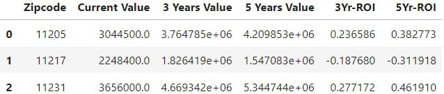

# Исследование и применение методов временных рядов для прогнозирования изменений в ценах на рынке недвижимости

[](https://colab.research.google.com/drive/1Z1g2BWrRoyoA-I5viIuESXShOkL-YWPG?usp=sharing)

## Установка

Запустите скрипт:

```sh
pip install jupyter
pip install nbconvert
```

```sh
jupyter nbconvert --to notebook --execute
file_name.ipynb
```

## Алгоритм работы

Данная модель реализует прогнозирование изменения цены недвижимости с помощью метода временных рядов. В качестве входных данных модель принимает информацию о ценах на недвижимость в Бруклине, полученную с сервиса [zillow](https://www.zillow.com/research/data/).

Учитывая обширный объем данных, мы ограничили выбор региона, выбрав только три почтовых индекса. Впоследствии эти данные могут быть использованы для дополнительного обучения модели.

В качестве модели используется модель SARIMA. Параметры предварительно подобранны с помощью критерия AIC (критерий информационной оценки AIC, применяемый для выбора оптимальных параметров модели).

Затем скрипт выполняет прогнозирование, используя выбранные параметры, оптимизированные на основе минимизации AIC.

В результате получаются данные об ожидаемом изменении цен на недвижимость в регионах, ограниченных почтовыми индексами. В качестве примера я представила цены на 3 и 5 лет вперед.



**Замечание:** Из-за недостаточного объема информации, предоставленного всего тремя почтовыми индексами, точность прогноза оказывается недостаточной.

## Использование

Если вы решите обучить модель на всех почтовых индексах, запустите следующий скрипт после завершения основной работы:

```python
zip_dfs = []
zip_list = dfm.RegionName.unique()
for x in zip_list:
    zip_dfs.append(pd.DataFrame(dfm[dfm['RegionName']==x][['MeanValue']].copy()))

p = d = q = range(0,2)
pdq = list(itertools.product(p,d,q))
pdqs = [(x[0], x[1], x[2], 12) for x in list(itertools.product(p, d, q))]
```

```python
start=time.time()
ans = []

for df, name in zip(zip_dfs, zip_list):
    for para1 in pdq:
        for para2 in pdqs:
            try:
                mod = sm.tsa.statespace.SARIMAX(df,
                                                order = para1,
                                                seasonal_order = para2,
                                                enforce_stationarity = False,
                                                enforce_invertibility = False)
                output = mod.fit()
                ans.append([name, para1, para2, output.aic])
                print('Result for {}'.format(name) + ' ARIMA {} x {}12 : AIC Calculated = {}'.format(para1, para2, output.aic))
            except:
                continue

```

**Замечание:**
Линейная модель с большим количеством дополнительных факторов, таких как федеральная процентная ставка, уровень безопасности рынка недвижимости и другие, является более точной по сравнению с чистой моделью временных рядов.
